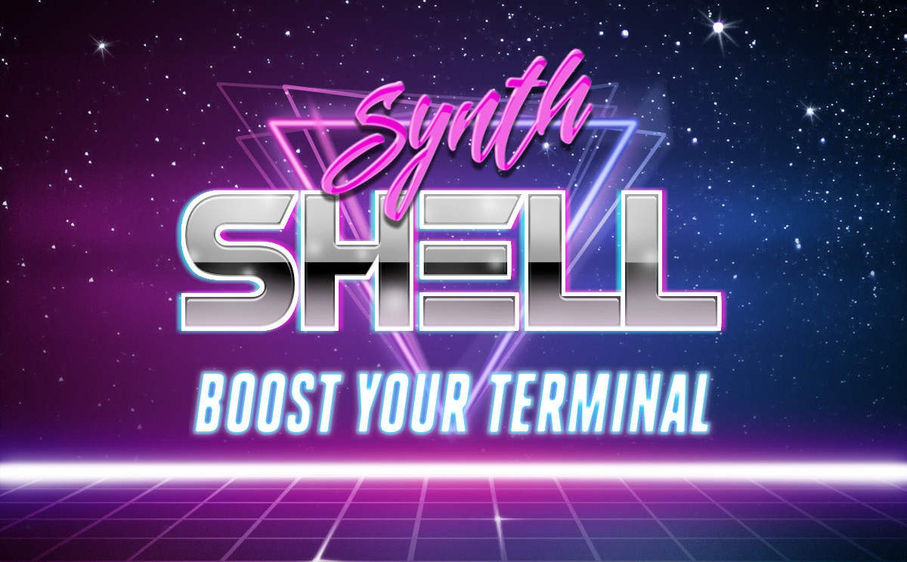
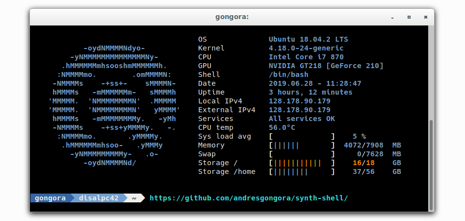

<!--------------------------------------+-------------------------------------->
#                                  Introduction
<!--------------------------------------+-------------------------------------->

**synth-bash** is a collection of small scripts meant to improve your terminal
and overal productivity - small tweaks can go a long way.
You can find more details and similar tools on
[Yet Another Linux'n Electronics Blog](https://yalneb.blogspot.com/).


<!--------------------------------------+-------------------------------------->
#                                     Setup
<!--------------------------------------+-------------------------------------->

### Automatic setup

The recommended way to install synth-shell is to run the provided setup script.
This will guide you step by step through the process and let you choose what
to install. It will also allow you to install the script for your user only,
or system-wide (super user privileges required). To proceed, 
[open and play this link in a separate tab](https://www.youtube.com/watch?v=k6ZMYWPQID0),
and execute the following commands in your shell:
```
git clone --recursive https://github.com/andresgongora/synth-shell.git
chmod +x synth-shell/setup.sh
synth-shell/setup.sh
rm -fr synth-shell
```


### Dependencies
If you want to use `fancy-bash-promt.sh` you also need power-line fonts.
Depending on your distro you can install it as:
```
#### ArchLinux
sudo pacman -S powerline-fonts

#### Debian, Ubuntu
sudo apt install fonts-powerline
```


### Script configuration/customization
You can configure your scripts by modifying the corresponding configurtion
files. In addition to said files, you can also find configuration examples
in the following folder.
```
## If you installed synth-shell for your user only
~/.config/synth-shell/

## If you isntalled it system-wide
~/etc/synth-shell/
```


### Manual instalation of individual scripts
If you want to skip the above steps, and are only intereset in a very
specific script, you can easily use it by its own.
However, some scripts might source other scripts from the `bash-tools` folder,
as they provided shared functioanlities to all scripts. If you are interested
in a single script from my collection, check whether it depends on a common
script, and copy the content of it into the script you want.
Also, some script might depend on third party packages which might require
your manual intervention. Check the content of each script for details.


### Uninstallation
It's hard to say goodbye, but we had good times together, didn't we? :)
Simply run the following commands and everything will be as before:
```
git clone --recursive https://github.com/andresgongora/synth-shell.git
chmod +x synth-shell/setup.sh
synth-shell/setup.sh uninstall
rm -fr synth-shell
```


<!--------------------------------------+-------------------------------------->
#                                    Overview
<!--------------------------------------+-------------------------------------->




### status.sh
Provides a report of your system status at one glance everytime you open a
new terminal. If it detects that any parameter (e.g. system load, memory, etc.)
is over a critical threshold, it will provide a warning and additional
information to identify the culprit. I also plot a configurable logo, so
you may impress your crush from the library with your unique ASCII art.


### fancy-bash-prompt.sh
Adds colors and triangular separators to you bash prompt. The triangles are
placed in an overlaping pattern to avoid accidental cuts if you were to touch
them.


<!--------------------------------------+-------------------------------------->
#                                   Contribute
<!--------------------------------------+-------------------------------------->

This project is only possible thanks to the effort of and passion of many, 
including mentors, developers, and of course, our beloved coffe vending machine.
If you like this collection of scripts and want to contribute in any way,
you are most welcome to do so.

You can find a detailed list of everyone involved in the development of
these scripts in [AUTHORS.md](AUTHORS.md). Thanks to all of you!


### Help us improve

* Add your own scripts: do you have some cool scripts you wold like to 
  add to this collection? Don't hesitate to create a pull-request or,
  alternatively, contact the authors over email.
* [Report a bug](https://github.com/andresgongora/synth-shell/issues): 
  if you notice that something is not right, tell us. 
  We'll try to fix it ASAP.
* Become a developer: fork this repo and become an active developer!
  Take a look at the [issuess](https://github.com/andresgongora/synth-shell/issues)
  for suggestions of where to start. Also, take a look at our 
  [coding style](coding_style.md).
* Push your one-time changes: even if its a tiny change, 
  feel free to fill in a pull-request!


### Git branches

There are two branches in this repository:

* **master**: this is the main branch, and thus contains fully functional 
  scripts. When you want to use the scripts as an _user_, 
  this is the branch you want to clone or download.
* **develop**: this branch contains all the new features and most recent 
  contributions. It is always _stable_, in the sense that you can use it
  without major inconveniences. 
  However, its very prone to undetected bugs and it might be subject to major
  unanounced changes. If you want to contribute, this is the branch 
  you should pull-request to.


<!--------------------------------------+-------------------------------------->
#                                     About
<!--------------------------------------+-------------------------------------->

Why **synth-shell**? That's a quite easy question. Its started out as a loose
bunch of (super simple) scripts that I kept around to aid me during
system maintenance. But after a while, a started to get the hang out of bash
and wrote more complex stuff. I wanted my code not only to work
and be purely useful, but also to provide some eye-candy.

Naturally, it didn't start the way you see it today. Many scripts started out as
an ugly attempt to get the behaviour I wanted, but using many snippets from
different third parties. This meant that the code was usually quite ugly and
full of bugs - not because of the third parties, but because of the way I
integrated them. yet over time, I rewrote all scripts from scratch, removed
the fluff, and also got lot's of help by super friendly and engaged 
[contributors](AUTHORS.md). The result is what you see today.
I admit it, it's nothing fancy, but writing these scripts provided me with
lots of joy.

And about the name? That's quite easy. I spent most of my coding frenzy
listening to [SynthWave](https://en.wikipedia.org/wiki/Synthwave).


<!--------------------------------------+-------------------------------------->
#                                    License
<!--------------------------------------+-------------------------------------->

Copyright (c) 2014-2019, Andres Gongora - www.andresgongora.com

* This software is released under a GPLv3 license.
  Read [license-GPLv3.txt](LICENSE),
  or if not present, <http://www.gnu.org/licenses/>.
* If you need a closed-source version of this software
  for commercial purposes, please contact the authors.

